<!-- markdownlint-disable MD033 -->
<!-- markdownlint-disable MD041 -->

# Adamekka

## Language Proficiency

| Tier  | Languages                                                                                                                                                                                                                                                                                                                                                                                                                                                                                                                                                                                                                                                                                                     |
| :---: | :------------------------------------------------------------------------------------------------------------------------------------------------------------------------------------------------------------------------------------------------------------------------------------------------------------------------------------------------------------------------------------------------------------------------------------------------------------------------------------------------------------------------------------------------------------------------------------------------------------------------------------------------------------------------------------------------------------ |
| **S** |                                                                                                                                                                                                                                                                                                                                                                                                                                                                                                                                                                                                             |
| **A** |                                                                                                    |
| **B** |        |

## Contacts

<!-- CONTACTS:START -->

<!-- markdownlint-disable MD033 MD041 -->

 Discord: adamekka  
 <a href="https://github.com/Adamekka">GitHub</a>  
 <a href="https://signal.me/#eu/_Zmgzf8MgMvXLs9dQR8jT2rLWAYFSnz9SC2SKM15ENyaGr05UIBAk6IAO3vwPYuu">Signal</a>  
 <a href="https://t.me/Adamekka">Telegram</a>

<!-- CONTACTS:END -->

---

    
    &nbsp;
    

